# Architecture Guide

The decisions this project is built on, and why. The README covers running,
layout and verification; this file covers the reasoning.

---

## Scope: three stacks, one core

Product list + detail, from two S3 endpoints. Graded on: application structure,
MVVM or VIPER, performance, image cache, exception handling, offline/caching
(Core Data), detail screen with large image + full title + description, unit
tests. **No third-party libraries.** Self-imposed: iOS 17+, Swift 5 language
mode.

The brief says "MVVM **or** VIPER". Building both is not indecision — it is the
proof that the Clean Architecture core is independent of what sits above it.
Same `ProductDomain`, same `ProductRepositoryLive`, same tests; three renderers:
`MVVM-C · UIKit` (primary), `MVVM-C · SwiftUI`, `VIPER · UIKit`.

**VIPER + SwiftUI is deliberately excluded.** Classic VIPER binds Presenter to
View through `protocol ProductListViewInterface: AnyObject`, held weakly. A
SwiftUI `View` is a struct — there is no stable reference to hold. Replace the
protocol with `@Published` state and the Presenter is a ViewModel in all but
name; what remains is Interactor-backed MVVM, not VIPER. Selecting VIPER in the
picker therefore locks the framework toggle to UIKit and shows the reason.

---

## Repository shape

```
TurkcellCase.xcworkspace             ← open THIS, not the .xcodeproj
App/                                 ← app-shaped targets ONLY
  TurkcellCase-UnalCelik.xcodeproj
  TurkcellCase-UnalCelik/            @main, Assets, Info.plist, entitlements
  TestPlans/                         Unit.xctestplan, Smoke.xctestplan
  TurkcellCase-UnalCelikUITests/     XCUITest: Base/, Pages/, Scenarios/, SmokeTests/
Packages/
  AppModules/   Package.swift · Sources/ · Tests/   ← this app's code
  CoreKit/      Package.swift · Sources/ · Tests/   ← reusable infrastructure
```

Neither package contains the `.xcodeproj`, and the project does not contain a
package: Xcode refuses to add a local package that contains its consumer, and
would otherwise show the app files twice. The **workspace** joins them; the app
target links `AppFeature` as a workspace-provided package product.

`.xcodeproj` is used for exactly what SPM cannot express: app targets and
XCUITest hosts. Everything else is manifest-first, the same model Tuist-based
codebases (Trendyol) and one-`Package.swift` codebases (isowords) use, with zero
tooling to install.

### Two packages, not one or nine

A **target** answers *what can import what*. A **package** answers *what ships
and versions together*. Both give identical compile-time enforcement — the
difference is the release boundary.

The line is drawn where reuse actually is: `NetworkingKit` and `DependencyEngine`
know nothing about products and would work in any app; `ProductDomain` is
meaningless anywhere else. Nine manifests would buy independent versioning
nobody uses, at the cost of atomic refactors. `Packages/CoreKit` can be lifted
to its own repo with `git filter-repo --subdirectory-filter Packages/CoreKit`
and a one-line `path:` → `url:` change.

### Source grouping

Sources are grouped by layer for navigation; every target carries an explicit
`path:`, so folders stay folders and each module is separately declared.

```
Packages/AppModules/Sources/            Packages/CoreKit/Sources/
  Application/AppFeature/ UITestSupport/  DependencyInjection/DependencyEngine/
  Domain/SharedDomain/                    Accessibility/AccessibilityKit/
  Domain/ProductDomain/                   Layout/LayoutKit/
  Data/ProductAPI/                        Networking/NetworkingKit{,Live}/
  Data/ProductRepositoryLive/             Persistence/PersistenceKit{,Live}/
  Shared/CommonKit/ CommonUI/             Logging/LoggingKit{,Live}/
  Shared/AccessibilityIdentifiers/        Caching/CachingKit/
                                          ImageLoading/ImageCacheKit{,Live}/
  Features/Product/ProductPresentation/
  Features/Product/ProductList/…
  Features/Product/ProductDetail/…
```

`Shared/` holds only domain-free code; everything product-specific that screens
share sits under `Features/Product/`. MVVM renderers nest inside the
ViewModel's folder (`ProductDetailMVVM/ProductDetailMVVMUIKit/`), so the parent
target lists them in `exclude:`. **A new subfolder under a parent target must be
added to its `exclude:`**, otherwise its files are silently compiled into the
parent.

---

## Module graph

Arrows point from a consumer to what it imports. The graph is simplified:
related targets are grouped, edges already implied through `CommonUI` or a
grouped box are left out (renderers also import `ImageCacheKit`, `LayoutKit`
and `AccessibilityIdentifiers` directly), and test-only `*Mocks`,
`TestSupport` and test targets are omitted. `Package.swift` is the source of
truth.

```mermaid
flowchart TB
    App["iOS app target"] --> AppFeature

    subgraph AppModules["AppModules — product-aware code"]
        direction TB

        AppFeature["AppFeature<br/>composition root"]
        UITestSupport["UITestSupport<br/>deterministic UI-test launch"]

        subgraph Features["Feature layer"]
            direction TB

            ListInterface{{"ProductListInterface"}}
            DetailInterface{{"ProductDetailInterface"}}

            ListUIKit["ProductListMVVMUIKit"]
            ListSwiftUI["ProductListMVVMSwiftUI"]
            ListVM["ProductListMVVM<br/>UI-independent ViewModel"]

            DetailUIKit["ProductDetailMVVMUIKit"]
            DetailSwiftUI["ProductDetailMVVMSwiftUI"]
            DetailVM["ProductDetailMVVM<br/>UI-independent ViewModel"]

            ListVIPER["ProductListVIPER"]
            DetailVIPER["ProductDetailVIPER"]

            Presentation["ProductPresentation<br/>display models · formatting · product copy"]

            ListUIKit --> ListVM
            ListSwiftUI --> ListVM
            ListUIKit --> ListInterface
            ListSwiftUI --> ListInterface

            DetailUIKit --> DetailVM
            DetailSwiftUI --> DetailVM
            DetailUIKit --> DetailInterface
            DetailSwiftUI --> DetailInterface

            ListVIPER --> ListInterface
            ListVIPER --> DetailInterface
            DetailVIPER --> DetailInterface

            ListVM --> Presentation
            DetailVM --> Presentation
            ListVIPER --> Presentation
            DetailVIPER --> Presentation
        end

        subgraph Shared["Shared application modules"]
            direction TB
            CommonKit["CommonKit<br/>domain-free presentation helpers"]
            CommonUI["CommonUI<br/>shared UIKit + SwiftUI components"]
            AccessibilityIDs["AccessibilityIdentifiers"]
        end

        subgraph Data["Data layer"]
            direction TB
            Repository["ProductRepositoryLive"]
            ProductAPI["ProductAPI<br/>DTOs · decoding · wire mapping"]

            Repository --> ProductAPI
        end

        subgraph Domain["Domain layer"]
            direction TB
            ProductDomain["ProductDomain<br/>entities · repository contract · use cases"]
            SharedDomain["SharedDomain<br/>Money · DomainError"]

            ProductDomain --> SharedDomain
        end

        ProductAPI --> ProductDomain
        Repository --> ProductDomain
        Presentation --> ProductDomain
        Presentation --> CommonKit
        CommonKit --> SharedDomain

        CommonUI --> CommonKit
        CommonUI --> AccessibilityIDs

        ListUIKit --> CommonUI
        ListSwiftUI --> CommonUI
        DetailUIKit --> CommonUI
        DetailSwiftUI --> CommonUI
        ListVIPER --> CommonUI
        DetailVIPER --> CommonUI

        AppFeature --> ListUIKit
        AppFeature --> ListSwiftUI
        AppFeature --> ListVIPER
        AppFeature --> DetailUIKit
        AppFeature --> DetailSwiftUI
        AppFeature --> DetailVIPER
        AppFeature --> Repository
        AppFeature --> UITestSupport
    end

    subgraph CoreKit["CoreKit — reusable infrastructure, no product knowledge"]
        direction TB

        CoreContracts["Infrastructure contracts<br/>NetworkingKit · PersistenceKit<br/>LoggingKit · ImageCacheKit"]

        CoreLive["Live implementations<br/>NetworkingKitLive · PersistenceKitLive<br/>LoggingKitLive · ImageCacheKitLive"]

        CoreUtilities["Independent utilities<br/>DependencyEngine · LayoutKit<br/>AccessibilityKit"]

        CachingKit["CachingKit"]

        CoreLive --> CoreContracts
        CachingKit --> CoreContracts
    end

    Repository --> CoreContracts
    Repository --> CachingKit
    Repository --> CoreUtilities
    CommonUI --> CoreContracts
    CommonUI --> CoreUtilities
    AccessibilityIDs --> CoreUtilities
    ListVIPER --> CoreUtilities
    DetailVIPER --> CoreUtilities
    UITestSupport --> CoreContracts

    AppFeature --> CoreLive
    AppFeature --> CoreContracts
    AppFeature --> CoreUtilities

    classDef interface stroke-dasharray: 6 4
    class ListInterface,DetailInterface interface
```



### Dependency rules

Read `Package.swift`; the `dependencies:` lists *are* the architecture.

| Rule | Why it matters |
|---|---|
| `SharedDomain` depends on nothing, and domains depend only on it | the centre stays free of URLSession and Core Data, and no domain imports another |
| `CommonKit` depends on no feature domain | shared presentation stays shared; product copy and display models live in `ProductPresentation` |
| No feature depends on `ProductRepositoryLive` | features see `ProductRepositoryInterface` only |
| Nothing links a `*Live` target except `AppFeature` | tests link `*Mocks`; URLSession and Core Data are absent from a feature test's build |
| `ProductListVIPER` sees `ProductDetailInterface`, never an implementation | the list cannot construct the detail |
| `ProductListMVVM` lists **no UI module** | "one ViewModel, two renderers" is a manifest fact, not a comment |

### Naming convention

| Suffix | Contains | Depends on |
|---|---|---|
| `XKit` | protocols + value types | nothing |
| `XKitLive` | the real implementation | `XKit` |
| `XKitMocks` | invoked/stubbed doubles, fixtures | `XKit` only |

Exceptions: `LayoutKit` is a UIKit constraint DSL with nothing to swap, and
`PersistenceKit` has no `Mocks` because its tests run the real stack against an
in-memory store.

---

## Clean Architecture layering

Clean is not duplicated per presentation architecture — it sits **underneath**
all three. There is exactly one `ProductDomain`.

| Layer | Target | Holds |
|---|---|---|
| Shared kernel | `SharedDomain` | `Money`, `DomainError` |
| Entities, use cases, boundaries | `ProductDomain` | `Product`, `FetchProductsUseCase`, `FetchProductDetailUseCase`, `ProductRepositoryInterface` |
| Wire format | `ProductAPI` | DTOs, DTO → domain mapping |
| Data | `ProductRepositoryLive` | endpoints, remote + local sources, the Core Data model, retention, error mapping |
| Presentation | feature targets | ViewModels / Presenters, views, navigation |

`Money` and `DomainError` sit in `SharedDomain` rather than `ProductDomain` so
that anything formatting money or presenting an error — and any future basket
or payment domain — does not have to import products.

Boundary discipline:

- `ProductDTO` and `NSManagedObject` never leave the data layer.
  `CoreDataStack` hands out an `NSManagedObjectContext` inside a closure and
  takes back only `Sendable` results.
- `URLSession → NetworkError → ProductRepository → DomainError` → user-facing
  copy. Only the repository translates to `DomainError`; `DomainErrorMapper`
  has exactly one caller.
- Views render `ProductDisplayModel` (already formatted), never `Product`.

Repositories compose rather than inherit: `CacheAsideLoader` (in CoreKit's
`CachingKit`) owns the fresh-else-fetch-then-write algorithm, and the repository
stays `final`, holding a loader, two data sources and a mapper. A
`BaseRepository` would collect every future repository's hooks until it owned
all their policies.

---

## MVVM-C

| Piece | Owns | Must not |
|---|---|---|
| Coordinator | navigation, screen creation | know view internals |
| ViewModel | state machine, use-case calls | `import UIKit` / `import SwiftUI` |
| View | render state, forward intent | perform navigation |

```swift
@MainActor
public final class ProductListViewModel: ObservableObject {
    @Published public private(set) var state: ViewState<[ProductDisplayModel]> = .idle
    public var onSelectProduct: ((String) -> Void)?   // intent out, not navigation
}
```

`ObservableObject` rather than `@Observable`: the UIKit controller needs a
Combine publisher to `sink` on, and `@Observable` does not expose one. That is
what lets one ViewModel drive both renderers.

The coordinator lives in `AppFeature`, above both feature modules. This is a
consequence of the module split, not a style preference —
`ProductListMVVMUIKit` cannot import `ProductDetailMVVMUIKit`, so only the
composition root can own the transition. MVVM modules conform to screen
factories that never mention `UINavigationController`:

```swift
func makeScreen(onSelectProduct: @escaping (String) -> Void) -> UIViewController
func makeScreen(productID: String, onFinish: @escaping () -> Void) -> UIViewController
```

`ProductFlowCoordinator` owns the `UINavigationController` and every
transition. One coordinator drives both renderers: SwiftUI screens arrive as
`UIHostingController`s on the same UIKit stack, so a second
`NavigationPath`-based coordinator would duplicate it without changing anything
observable.

### UIKit conventions

Programmatic, no storyboards. Views are declared with their appearance already
applied; `lazy var` only where the closure needs `self`. Constraints go through
`LayoutKit`, a small DSL in CoreKit:

```swift
container.addSubview(content, pinnedToEdges: .all(16))

label.layout
    .below(icon, spacing: 8)
    .pinHorizontally(to: container, insets: .horizontal(16))
```

Insets are `NSDirectionalEdgeInsets` and positioning uses `after`/`before`, so
layouts mirror in RTL. The diffable identifier is `Product.id`, not the display
model, so a price change is a `reconfigureItems` on the live cell rather than a
delete + insert that reloads its image.

---

## VIPER

Five contracts per module, assembled by plain initializer injection inside
`createModule`:

```swift
let view       = ProductListViewController()
let interactor = ProductListInteractor(fetchProducts: ...)
let router     = ProductListRouter(navigationController: nav)
let presenter  = ProductListPresenter(view: view, interactor: interactor, router: router)
view.presenter = presenter
```

**The Interactor wraps the shared use case** rather than talking to the
repository directly. The VIPER-pure reading treats the Interactor *as* the use
case; that would give the app two cores and defeat the shared-domain thesis, so
the Interactor stays a thin composition seam.

The Router is where VIPER differs structurally from MVVM-C: navigation lives
**inside** the module, so the module needs its destination without being
allowed to import it. That is the one place a runtime registry earns its keep.

---

## Dependency injection

Two mechanisms, one rule.

| What you need | How you get it |
|---|---|
| Something inside your own module | initializer injection |
| Something from another module you may not import | `@Dependency` |

The only `@Dependency` in the app is `ProductListRouter.detailModule`. The
`*Live` kits are registered once at launch and resolved by the composition
root. Every ViewModel, Presenter, Interactor and mapper takes its collaborators
through `init`, so feature tests never touch the engine. Going all-`@Dependency`
would trade compile-time safety on ~30 objects to solve a problem one has.

**Registrations are single shared instances**, built lazily on first resolve.
This is load-bearing: the repository owns the offline cache and the image
loader owns the image cache, so rebuilding them per resolve would drop both on
every architecture switch. `registerFactory` exists for the rare dependency
that must not be shared.

The architecture toggle rides on this. `FlowRegistration.makeCoordinator(for:engine:)`
builds each flow from the same engine-resolved repository and image loader;
VIPER additionally registers its detail module so the Router can resolve it:

```swift
engine.register(value: detail, for: ProductDetailInterface.self)
return VIPERFlowCoordinator(list: VIPERProductListModule(…))
```

Runtime values — base URL, freshness window, `URLCache` and decoded-image
limits — live in one `AppConfiguration.default` in `AppFeature`. CoreKit takes
its own configuration types and never sees `AppConfiguration`.

`DependencyEngine` is written clean-room; the pattern is published, the
reference implementation is not copied.

---

## Images

The API's JPEGs range from 257×285 to 2418×2192 and land in a 177pt cell.
Decoding the largest whole costs ~21 MB, so the pipeline is size-aware end to
end:

```
ImageRequest(url:pointSize:scale:)   pixel size is part of the cache key,
                                     rounded up to a 128px bucket
        |
ImageLoader                          cache-first
   +-- InFlightRegistry              one shared task per request
   +-- CGImageDownsampler            ImageIO thumbnail, off the main actor
   +-- NSCacheImageCache             decoded, cost-limited, evicts on warning
        |
ImagePrefetcher                      speculative, driven by the collection view
```

- **The cache key is `(URL, bucketed pixel size)`.** A thumbnail and a detail
  image are different entries; the 128px step lets rotation and split view
  reuse one. Powers of two were rejected: a 555px cell would decode at 1024px.
  `ImageRequest` owns the arithmetic, so a prefetch and the cell it warms cannot
  compute different keys.
- **One shared task per in-flight request.** Otherwise a prefetch and the cell
  that catches up download the same bytes twice.
- **Downsampling is a `nonisolated async` func, not `Task.detached`**, so it
  inherits cancellation — a scrolled-away cell does not decode 5 megapixels
  nobody sees.
- **Cancellation is never rendered as failure.** A real failure is an explicit
  state (placeholder glyph, "Image unavailable" for VoiceOver); a cancel from
  reuse or resize is not, or the grid would flash broken images mid-scroll.
- **`cancelPrefetch` releases interest but does not abort.** Aborting shared
  work could kill a visible cell's load that joined the same request; the bytes
  land in the cache instead.

Encoded bytes belong to a configured `URLCache`; decoded bitmaps to `NSCache`.
These endpoints send no `Cache-Control` and a 2015 `Last-Modified`, so anything
that can change asks for `HTTPCachePolicy.revalidate` instead of trusting
heuristic freshness. Measured on the list screen: resident memory fell from
67.0 MB to 30.9 MB, and a full scroll issues exactly 12 requests for 12
products.

---

## Freshness and retention

### When the device is allowed to answer

A cached copy is used **only while it is still current**. Every fetch is stamped
with its time, and for ten minutes after that the device answers on its own —
no request at all. Past ten minutes the cache stops being an answer: the network
is asked, and if it cannot be reached the screen says so.

```
within 10 min          cache hit, instant, no request
past 10 min            wait for the network
past 10 min, offline   "You're offline" — never a stale price
```

**Why not the faster-looking options.** Two were built first and removed.

*Remote-first with a cache fallback* — ask the network, fall back to disk on
failure — is always available offline, but it will happily show a copy from any
point in the past with no indication that it is old.

*Show the cache immediately, refresh behind it* is quicker still and was the
better-feeling version to use. It has the flaw that decided this: the user reads
a price, and a moment later it changes under them. On a product list that is
untidy. On anything that matters — a balance, a message, an order total — it is
the difference between stale and wrong. And when the refresh never returns, the
stale copy simply stays on screen wearing no label.

A brief spinner is a smaller cost than a number the user cannot trust. So
freshness decides, not latency. The window is a required argument
(`ProductRepository(timeToLive:)`) with no default, set once in
`AppConfiguration.default`, because ten minutes is right for a catalogue and
wrong for a chat. `FreshnessPolicy` takes an injected `now`, so tests move a
clock instead of sleeping.

**Images are exempt, deliberately.** They are addressed by URL: if the product
data is current, its `imageURL` is current, and the bytes at that URL are what
they are. `URLCache` governs them by HTTP freshness, and `NSCache` keeps the
decoded copies. Ageing those out on a timer would re-decode constantly and buy
no correctness.

### What the device keeps

`ProductRepositoryLive` owns a Core Data model of one entity, `CDProduct`. A
"detail" is not a separate record — it is two more columns on the row the list
already wrote:

```
id    listPosition   detailVisitedAt   productDescription
1     0              14:02:11          An apple a day keeps the…   ← opened
2     1              –                 –                           ← not opened
```

`detailVisitedAt` is the detail's fetch stamp, read as the `CacheEntry`'s
`fetchedAt`; the list has its own `listFetchedAt`.

**The page bounds the store.** The list keeps one whole page, replacing the
previous one; a product that drops out of it takes its description with it,
because tapping the list is the only way to reach a detail. A cache holding a
fraction of a page could not render the list coherently offline. All twelve
descriptions come to 1.9 KB, so there is no tighter limit — byte budgets belong
on `NSCache` and `URLCache`, where one entry is ~9,000× a row.

`PersistenceKit` is a Core Data **stack**, not a key-value store:
`CoreDataStack(modelName:bundle:)` loads the caller's model, so the entities
live in the data layer and CoreKit knows nothing about products. `read` and
`write` are separate so who saves is in the type; `write` rolls back on throw.

---

## Failure handling

| Failure | What happens |
|---|---|
| Cache read fails | logged, treated as a miss — the network answers |
| Cache write fails | logged; the request still succeeds with the fresh data |
| Store will not open | a ladder, not a `fatalError`: open on disk → destroy and reopen → in memory → a container whose every call throws, which the repository already treats as a miss. Each rung is logged |
| Backend refuses a request | the error body's `<Message>` becomes `DomainError.server(message:)` and is shown as is; without one, the generic error. No status code is given a meaning of ours |
| Image fails to load | shimmer stops, a placeholder shows, VoiceOver reads "Image unavailable" |
| A flow module is not registered | logged and `assertionFailure` — never a dead button |

- **The store reports; the repository decides.** `ProductLocalDataSource`
  throws rather than returning `nil`, so a broken store is not
  indistinguishable from an empty one. The repository's cache policy is
  best-effort and never reaches the user.
- **Absorbed errors still leave a trace.** `LoggingKit` is a small seam over
  `os.Logger`, injected rather than global so the absorbing code can be tested
  against a `SpyLogger`. `ProductRepository` has no default logger, so a
  composition root that forgets it does not compile.
- **`DomainError` keeps no underlying cause.** That would put infrastructure
  errors into the domain; the cause is logged at the one place it is thrown
  away instead.
- **The store-open ladder is the migration policy.** One model version, no
  `NSMigrationPolicy`: the store is a cache, so an incompatible model is
  dropped and rebuilt. A store holding user-authored data could not make that
  trade.

User-facing copy lives in English String Catalogs owned by each module
(`CommonKit`, `ProductPresentation`, `AppFeature`) behind `AppStrings`, keyed
semantically. SwiftUI views take the resolved `String`, since a literal would be
looked up in the main bundle.

---

## Testing

Unit tests cover **logic only**: view models, presenters, interactors, routers,
use cases, mappers and the data layer. Views and layout are covered by UI
tests.

| Rule | Why |
|---|---|
| One `*Tests` target per module, beside it | fast, focused builds; ownership is obvious |
| Stored subject + collaborators, built in `setUp()` → `reCreate(...)`, released in `tearDown()` | variants call `reCreate` with arguments. XCTest keeps every test-case instance alive for the whole run, so `tearDown` must nil everything |
| Mocks use `invokedX` / `invokedXCount` / `invokedXParameters(List)` / `stubbedX` | tests read as assert-before, act, assert-after |
| Shared doubles live in `*Mocks` modules under `Tests/` | regular targets, since a test target cannot depend on another, but `Sources/` holds only what ships |
| Product data comes from captured API responses | `ProductFixture` decodes the JSON through the real `ProductAPI` DTOs and mapper, so fixtures cannot drift from the wire format |
| Time is never the synchronisation mechanism | view models and presenters expose `loadTask`; tests `await loadTask?.value`. Held-open work uses `AsyncGate`; freshness moves a test clock |
| `TestSupport` is the only target that imports XCTest | `*Mocks` stay XCTest-free so the UI-test launch mode can reuse them |

The repository tests are the one place a real implementation is exercised: the
real repository over a `MockHTTPClient` and an in-memory Core Data store.

### UI tests

XCUITest drives the real app in another process, so it cannot inject a Swift
double. The two sides share a contract instead:

| Piece | Where | Role |
|---|---|---|
| `UIElement` | CoreKit `AccessibilityKit` | a stable, semantic identifier, applied to UIKit and SwiftUI views alike |
| `UIElements` | AppModules `AccessibilityIdentifiers` | every identifier the app exposes, one enum per screen. Views set them, page objects look them up — a rename cannot happen on one side only |
| `UITestLaunchConfiguration` | AppModules `UITestSupport` | the test encodes the flow and HTTP stubs into the launch environment; in DEBUG the app answers every request through `StubbedHTTPClient`, keeps Core Data in memory and turns animations off. The app contains no fixture data |

The target is split into `Base/` (`BaseUITest`, `Page`), `Pages/` (one page
object per screen; navigating actions return the next page), `Scenarios/`
(what the backend answers, from the same captured JSON as the unit tests) and
`SmokeTests/`. No `sleep`: every wait is on the UI's own state. Copy is asserted
only where no identifier can stand in, with the locale pinned to `en_US`.

---

## Known gaps

Deferred deliberately, recorded here rather than as scattered `TODO`s.

| Gap | Why it is acceptable |
|---|---|
| No concurrency ceiling on decodes | measured: a limiter at 2 moved peak footprint by nothing. `URLSession` caps connections per host at ~6 and ImageIO decodes subsampled, so decodes never stack |
| Prefetch cancellation is not reference-counted | counting interested parties would allow a true abort of shared downloads. Worth it at pagination scale, not at twelve items |
| No disk tier for decoded images | encoded bytes are `URLCache`'s job; decoded bitmaps stay in memory |
| No Core Data migration policy | the store is a cache and rebuilds itself — see [Failure handling](#failure-handling) |

---

## Working on the project

**Close Xcode before moving files.** The project uses
`PBXFileSystemSynchronizedRootGroup`, so Xcode re-materialises files that move
underneath it, which silently produces duplicates (a second `.xcdatamodeld`
breaks the build with "Multiple commands produce …").
