# Turkcell BiP iOS Case Study

## TLDR - My shorter explanation
Before AI generated documentation below, I wanted to explain the project with my own words.
The dependency modularity and architecture might seem like an overkill for a two paged app, but the purpose was to demonstrate the modularity. Without a 3rd party dependency management like Tuist or Bazel etc, it's written with SPM. Each feature can be built and tested separately, therefore it speeds up the development process and also the build and testing time on CI/CD.

ℹ️ The reason I've made both MVVM and VIPER is for demonstration purposes. I've worked with VIPER for the last 5 years, but the future is returning back to MVVM and as far as I've learned, your team works on MVVM. Since the app is highly modularized, dropping VIPER means deleting its folders and unwiring it from Package.swift and AppFeature. Nothing in the MVVM modules changes.

Performance is frequently checked with Instruments and also with debug logs, there is a special branch named `analyze/performance-tracing` which consists needed infrastrucre for performance tracing. But it's not on the main branch. App benefits heavily from caching for performance. As you can see in tracing, there are no hangs or memory leaks.


Caching: currently the app has no paginated data, but again for demonstration, it is handling the response as the first wave of the data and storing it on CoreData. The details caching mechanism depends on the list cache, if Orange is removed from the cache when a new wave of list data appears, the detail's of orange is also removed from the CoreData.
The images are being cached outside of the CoreData, they use a mixture of NSCacheImageCache and URLCache.
They don't live in CoreData forever, the decision was to keep them for 10 minutes since they are not so dynamic data. The timing can be changed.

| Loading | Cached Detail | List Persistence |
|:-------:|:-------------:|:----------------:|
|  |  |  |


Project includes Unit and UI tests, both using XC framework. Not SwiftTest.

Thanks for inspecting

## Docs

Product list + detail. Two local Swift packages, three presentation stacks over
one shared Clean Architecture core. No third-party libraries.

> **Start here:** `MVVM-C · UIKit` is the primary path. The other two exist to
> demonstrate that the core is independent of the architecture above it — same
> `ProductDomain`, same repository, same tests, three renderers.

Design decisions and their reasoning live in **[ARCHITECTURE.md](ARCHITECTURE.md)**.

## Running

```bash
open TurkcellCase.xcworkspace     # then ⌘R
```

**Open the workspace, not `App/TurkcellCase-UnalCelik.xcodeproj`.** The bare
project cannot resolve `AppFeature` — the workspace is what joins the project
to the two local packages. Every dependency is a local `.package(path:)`, so
there is nothing to install or fetch.

<details>
<summary>Launching entirely from the command line</summary>

```bash
xcodebuild -workspace TurkcellCase.xcworkspace -scheme TurkcellCase-UnalCelik \
  -destination 'platform=iOS Simulator,name=iPhone 17 Pro' \
  -derivedDataPath .build/dd build

UDID=$(xcrun simctl list devices available | grep -m1 'iPhone 17 Pro (' \
       | sed -E 's/.*\(([0-9A-F-]{36})\).*/\1/')

xcrun simctl boot "$UDID"; xcrun simctl bootstatus "$UDID" -b
xcrun simctl install "$UDID" \
  .build/dd/Build/Products/Debug-iphonesimulator/TurkcellCase-UnalCelik.app
xcrun simctl launch "$UDID" unalce.TurkcellCase-UnalCelik
```

`xcodebuild build` only compiles — it does not install or launch, which is why
the `simctl` steps are needed. (`simctl boot` returns error 405 if the device
is already booted; harmless.)

</details>

## Layout

```
TurkcellCase.xcworkspace                 ← open this
App/TurkcellCase-UnalCelik.xcodeproj     app bundle and UI tests only
Packages/AppModules/                     this app's code
Packages/CoreKit/                        reusable infrastructure, no product knowledge
```

The app target is a thin shell that links one product, `AppFeature`:

```swift
@main
struct TurkcellCase_UnalCelikApp: App {
    var body: some Scene { WindowGroup { AppRootView().ignoresSafeArea() } }
}
```

Every folder under `Sources/` that `Package.swift` declares as a target is a
module the compiler polices: a wrong-direction `import` does not build. The
`dependencies:` lists *are* the architecture — see
[Dependency rules](ARCHITECTURE.md#dependency-rules).

### Module graph

Arrows point from a consumer to what it imports. The graph is simplified:
related targets are grouped, edges already implied through `CommonUI` or a
grouped box are left out (renderers also import `ImageCacheKit`, `LayoutKit`
and `AccessibilityIdentifiers` directly), and test-only `*Mocks`,
`TestSupport` and test targets are omitted. `Package.swift` is the source of
truth.

```mermaid
flowchart TB
    App["iOS app target"] --> AppFeature

    subgraph AppModules["AppModules — product-aware code"]
        direction TB

        AppFeature["AppFeature<br/>composition root"]
        UITestSupport["UITestSupport<br/>deterministic UI-test launch"]

        subgraph Features["Feature layer"]
            direction TB

            ListInterface{{"ProductListInterface"}}
            DetailInterface{{"ProductDetailInterface"}}

            ListUIKit["ProductListMVVMUIKit"]
            ListSwiftUI["ProductListMVVMSwiftUI"]
            ListVM["ProductListMVVM<br/>UI-independent ViewModel"]

            DetailUIKit["ProductDetailMVVMUIKit"]
            DetailSwiftUI["ProductDetailMVVMSwiftUI"]
            DetailVM["ProductDetailMVVM<br/>UI-independent ViewModel"]

            ListVIPER["ProductListVIPER"]
            DetailVIPER["ProductDetailVIPER"]

            Presentation["ProductPresentation<br/>display models · formatting · product copy"]

            ListUIKit --> ListVM
            ListSwiftUI --> ListVM
            ListUIKit --> ListInterface
            ListSwiftUI --> ListInterface

            DetailUIKit --> DetailVM
            DetailSwiftUI --> DetailVM
            DetailUIKit --> DetailInterface
            DetailSwiftUI --> DetailInterface

            ListVIPER --> ListInterface
            ListVIPER --> DetailInterface
            DetailVIPER --> DetailInterface

            ListVM --> Presentation
            DetailVM --> Presentation
            ListVIPER --> Presentation
            DetailVIPER --> Presentation
        end

        subgraph Shared["Shared application modules"]
            direction TB
            CommonKit["CommonKit<br/>domain-free presentation helpers"]
            CommonUI["CommonUI<br/>shared UIKit + SwiftUI components"]
            AccessibilityIDs["AccessibilityIdentifiers"]
        end

        subgraph Data["Data layer"]
            direction TB
            Repository["ProductRepositoryLive"]
            ProductAPI["ProductAPI<br/>DTOs · decoding · wire mapping"]

            Repository --> ProductAPI
        end

        subgraph Domain["Domain layer"]
            direction TB
            ProductDomain["ProductDomain<br/>entities · repository contract · use cases"]
            SharedDomain["SharedDomain<br/>Money · DomainError"]

            ProductDomain --> SharedDomain
        end

        ProductAPI --> ProductDomain
        Repository --> ProductDomain
        Presentation --> ProductDomain
        Presentation --> CommonKit
        CommonKit --> SharedDomain

        CommonUI --> CommonKit
        CommonUI --> AccessibilityIDs

        ListUIKit --> CommonUI
        ListSwiftUI --> CommonUI
        DetailUIKit --> CommonUI
        DetailSwiftUI --> CommonUI
        ListVIPER --> CommonUI
        DetailVIPER --> CommonUI

        AppFeature --> ListUIKit
        AppFeature --> ListSwiftUI
        AppFeature --> ListVIPER
        AppFeature --> DetailUIKit
        AppFeature --> DetailSwiftUI
        AppFeature --> DetailVIPER
        AppFeature --> Repository
        AppFeature --> UITestSupport
    end

    subgraph CoreKit["CoreKit — reusable infrastructure, no product knowledge"]
        direction TB

        CoreContracts["Infrastructure contracts<br/>NetworkingKit · PersistenceKit<br/>LoggingKit · ImageCacheKit"]

        CoreLive["Live implementations<br/>NetworkingKitLive · PersistenceKitLive<br/>LoggingKitLive · ImageCacheKitLive"]

        CoreUtilities["Independent utilities<br/>DependencyEngine · LayoutKit<br/>AccessibilityKit"]

        CachingKit["CachingKit"]

        CoreLive --> CoreContracts
        CachingKit --> CoreContracts
    end

    Repository --> CoreContracts
    Repository --> CachingKit
    Repository --> CoreUtilities
    CommonUI --> CoreContracts
    CommonUI --> CoreUtilities
    AccessibilityIDs --> CoreUtilities
    ListVIPER --> CoreUtilities
    DetailVIPER --> CoreUtilities
    UITestSupport --> CoreContracts

    AppFeature --> CoreLive
    AppFeature --> CoreContracts
    AppFeature --> CoreUtilities

    classDef interface stroke-dasharray: 6 4
    class ListInterface,DetailInterface interface
```



## The three stacks

| | MVVM-C · UIKit | MVVM-C · SwiftUI | VIPER · UIKit |
|---|---|---|---|
| View | `UIViewController` | `struct View` | `UIViewController` + view protocol |
| Logic | `ProductListViewModel` | **same type** | `Presenter` + `Interactor` |
| Binding | `$state.sink` | `@ObservedObject` | `weak var view` |
| Navigation | `ProductFlowCoordinator` in `AppFeature` | **same coordinator** (screens are hosted) | `Router` inside the module |

The in-app picker switches between them. Switching builds a new coordinator
over the same core; the repository and image cache are shared instances, so
toggling mid-session refetches nothing — the visible proof that the core is
untouched. VIPER + SwiftUI is deliberately not offered
([why](ARCHITECTURE.md#scope-three-stacks-one-core)).

## Highlights

- **Size-aware image pipeline** — decode at the cell's pixel size, one shared
  download per request. List-screen memory fell from 67.0 MB to 30.9 MB.
  [Images](ARCHITECTURE.md#images)
- **Freshness over latency** — the device answers for ten minutes, then the
  network does; offline past that says so instead of showing a stale price.
  [Freshness and retention](ARCHITECTURE.md#freshness-and-retention)
- **A store that cannot take the app down** — open on disk, else rebuild, else
  run in memory. [Failure handling](ARCHITECTURE.md#failure-handling)
- **One ViewModel, two renderers**, enforced by the manifest, not a comment.
  [MVVM-C](ARCHITECTURE.md#mvvm-c)
- **202 unit tests** and a UI smoke suite that runs against stubbed responses.
  [Testing](ARCHITECTURE.md#testing)

## Notes from the live API

Verified against the endpoints, not assumed:

- **`product_id` is a `String`** — one product ships as `"6_id_is_a_string"`.
  `Int` drops it silently.
- **Prices are integers in minor units** — `9` is 0.09, `557` is 5.57. Held as
  `Money(minorUnits:)`, never `Double`.
- **An unknown id returns HTTP 403, not 404** — the S3 bucket denies listing,
  and the body says `<Message>Access Denied</Message>`. That text is shown as
  it is; no status code is given a meaning of ours.
- **No currency field** — the domain assumes USD in `Money`; the store has no
  default of its own.
- **The list omits `description`; the detail supplies it** — the local store
  merges rather than overwrites.
- **Images are ~576 KB each, up to 2418×2192** — hence downsampling.

## Verifying

Both packages are iOS-only, so plain `swift test` will not work; use a
simulator destination.

```bash
# All unit tests (both packages) through the app scheme's Unit test plan.
xcodebuild test -workspace TurkcellCase.xcworkspace -scheme TurkcellCase-UnalCelik \
  -testPlan Unit -destination 'platform=iOS Simulator,name=iPhone 17 Pro'
```

```bash
# UI smoke suite: launches the app against stubbed responses, no network.
xcodebuild test -workspace TurkcellCase.xcworkspace -scheme TurkcellCase-UnalCelik \
  -testPlan Smoke -destination 'platform=iOS Simulator,name=iPhone 17 Pro'
```

```bash
# One package on its own (swap in AppModules / AppModules-Package).
cd Packages/CoreKit && xcodebuild -scheme CoreKit-Package \
  -destination 'platform=iOS Simulator,name=iPhone 17 Pro' test
```

## Status

List and detail render on all three stacks. **202 unit tests green**
(143 AppModules + 59 CoreKit) and a 5-test UI smoke suite: list → detail → back
on each stack, offline-then-retry, and the empty state. Core Data and the image
pipeline are real — no stand-ins left. Deliberately deferred items are listed
under [Known gaps](ARCHITECTURE.md#known-gaps).
